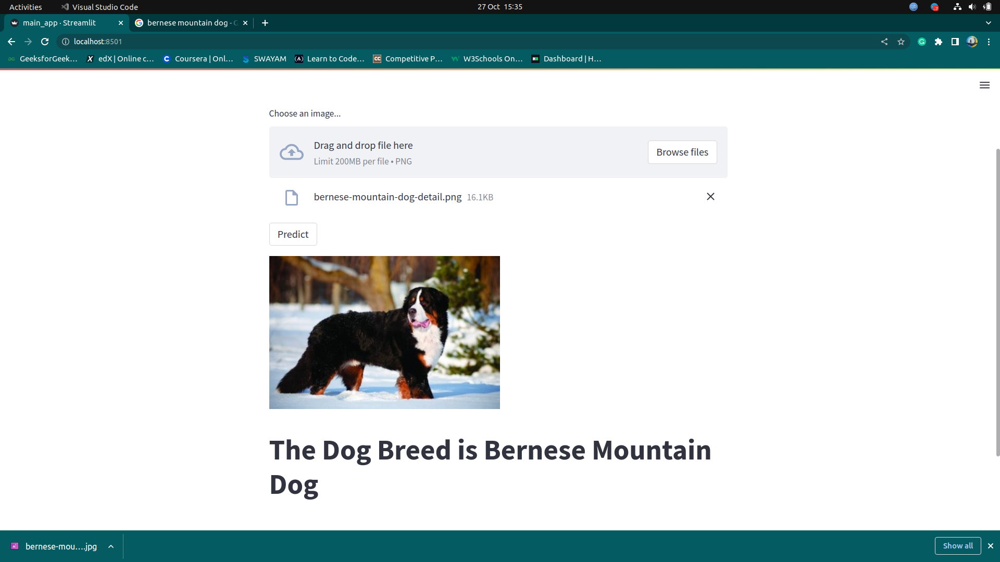

# dog-breed-classification
In this project, we will see how to use Keras and Tensorflow to build train, and test a Convolutionnal Neural Network capable of identifying the breed of a dog in a custom image.  This is a supervised learning problem, specifically a multiclass classification problem.

## Scope
This product can be used to predict different breeds of dogs which can be further used by different NGO's working on saving animals and for educational purposes also.

## Run
Step to run application:

Step 1: Create the copy of the project.

Step 2: Open command prompt and change your current path to folder where you can find 'app.py' file.

Step 3: Create environment by command given below:` $ conda create -name <environment name>`

Step 4: Activate environment by command as follows: `$ conda activate <environment name>`

Step 5: Use command below to install required dependencies: `$ python -m pip install -r requirements.txt`

Step 6: Run application by command: `$ streamlit run main_app.py` You will get url copy it and paste in browser.

Step 7: You can download a picture from the internet and upload it on the website, then click `predict` button to get the output.

## Model
We created a CNN network architecture for the model.

We have used different types of layers according to their features namely:

1. `Conv_2d` (It is used to create a convolutional kernel that is convolved with the input layer to produce the output tensor)

2. `max_pooling2d` (It is a downsampling technique which takes out the maximum value over the window defined by poolsize)

3. `flatten` (It flattens the input and creates a 1D output)

4. `Dense` (Dense layer produce the output as the dot product of input and kernel).

## Dataset 
Kaggle: catherinehorng/dogbreedidfromcomp : https://www.kaggle.com/catherinehorng/dogbreedidfromcomp

## Illustration

### Input

### Output

 

## Summary
We started with downloading the dataset creating the model and finding out the predictions using the model. We can optimize it using different hyper parameters in order to tune this model for a higher accuracy.